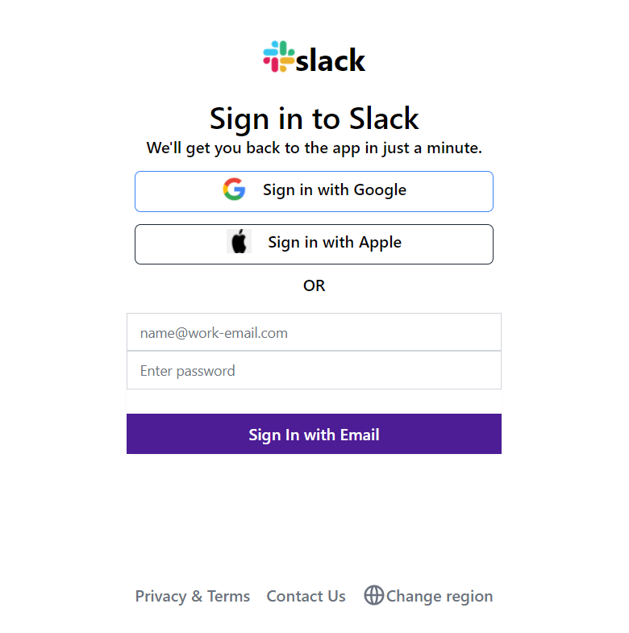
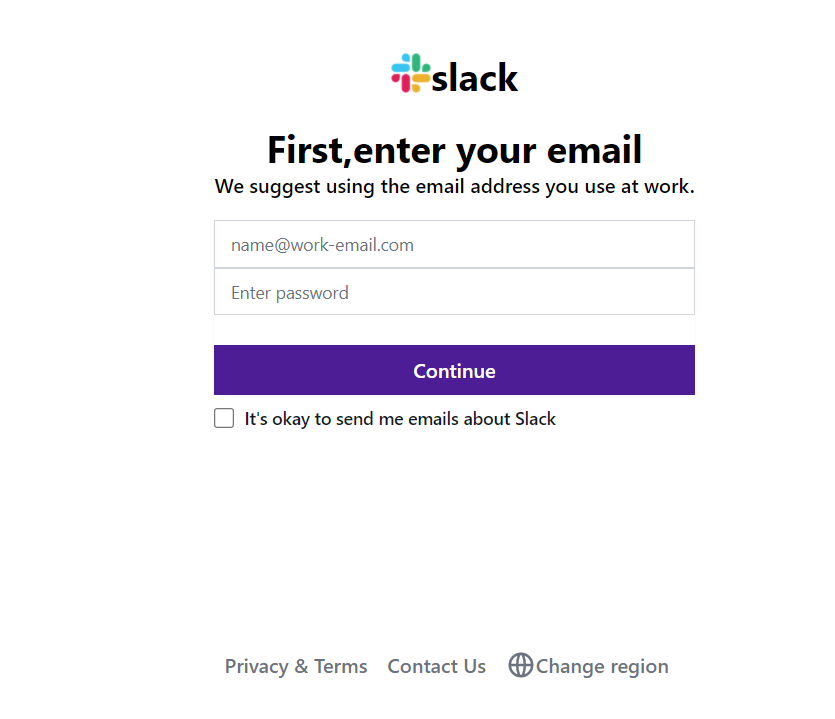

## Tech Stack 
HTML & Tailwind CSS

## Start Live Server and view output on your system.

## Showcase

<table align="center">
    <tr>
        <td>
            <a href="https://github.com/Virajj28/Slack-UI-Tailwind/blob/main/images/Login.png">
                

                    
                    
Login Page

                

            </a>
        </td>
    </tr>
    <tr>
        <td>
            <a href="https://github.com/Virajj28/Slack-UI-Tailwind/blob/main/images/Register.png">
                

                    
                    
Register Page

                

            </a>
        </td>
    </tr>
    <tr>
        <td>
            <a href="https://github.com/Virajj28/Slack-UI-Tailwind/blob/main/images/Sign-In%20Org.png">
                

                    
                    
Sign-In Org Page

                

            </a>
        </td>
    </tr>
    <tr>
        <td>
            <a href="https://github.com/Virajj28/Slack-UI-Tailwind/blob/main/images/Workspace%20login.png">
                

                    
                    
Workspace Login Page

                

            </a>
        </td>
    </tr>
    <tr>
        <td>
            <a href="https://github.com/Virajj28/Stock-React-Router/blob/main/readme/rsi.png">
                

                    
                    
RSI Page

                

            </a>
        </td>
    </tr>
</table>